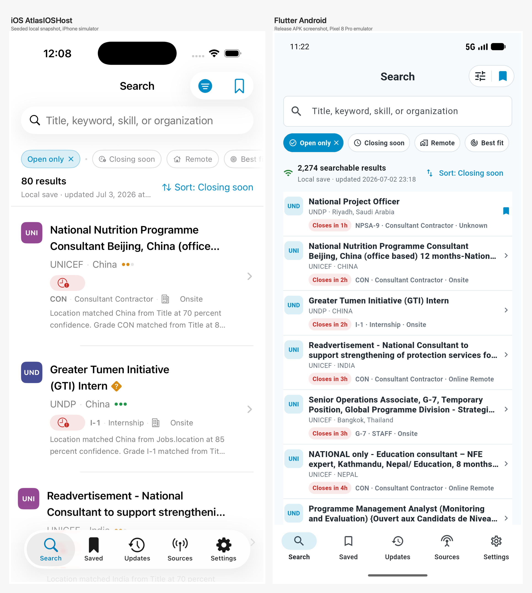

# Android Search UI Audit

Date: 2026-07-03
Branch: `codex/atlas-flutter-android-parity`
Slice: final Android parity closure

## Executive Result

The Flutter Android app now has a materially stronger Search parity slice plus implemented
Updates, Sources, Saved, Settings, and Job Detail flows. The final Android screenshots were
captured from the installed release APK on `emulator-5554` against the LAN backend
`http://10.253.1.43:8765`.

This is not a final 80%+ or 90%+ completion claim. Human testing superseded the previous score:
Android still lacks full iOS filter parity and icon parity. The persistent-cache blocker has a
new code/test slice, but the cache still needs emulator offline-restart screenshot evidence and
the filter/icon blockers remain open.

## iOS Reference Availability

No checked-in iOS screenshot bundle was found under `apps/apple/PreviewHost` or the Flutter
docs loop folders. To reduce the evidence gap, `AtlasIOSHost` was built for the booted iOS
simulator and seeded with an `AtlasLocalCache` snapshot generated from the same local API.
This produced a populated iOS Search reference screen:

- `screenshots/ios-reference/iteration-7/ios_search_seeded_top.png`
- `screenshots/iteration-7/search_top_ios_android_side_by_side.png`
- `screenshots/ios-reference/iteration-8/ios_search_top.png`
- `screenshots/iteration-8/search_top_ios_android_side_by_side.png`

The seeded iOS snapshot intentionally contains the first 80 default Search rows so the visual
layout can be compared without relying on simulator networking. It is not a count-reconciliation
source; Android still uses the live Search total of `2,274 searchable results`.

Iteration 8 refreshed the iOS Search top capture from `AtlasIOSHost` with the same local snapshot
model and generated a new side-by-side comparison against the current Android release screenshot.
Additional iOS filter, sort, detail, and tab screenshots were not captured in this session because
the available `simctl` build exposes screenshot/status-bar/UI-setting commands but no direct tap
or scroll input, `cliclick` is not installed, and AppleScript GUI scripting did not expose the
Simulator process reliably enough to use as review evidence.

The remaining iOS source contract is:

- `apps/apple/Sources/AtlasUI/SearchScreen.swift`
- `apps/apple/Sources/AtlasUI/SearchViewModel.swift`
- `apps/apple/Sources/AtlasUI/JobResultRow.swift`
- `apps/apple/Sources/AtlasUI/JobDetailView.swift`
- `apps/apple/Sources/AtlasUI/AtlasSearchFilters.swift`

## Side-By-Side Review Package

| Screen | iOS reference | Previous Android evidence | Final Android evidence | Review checklist |
| --- | --- | --- | --- | --- |
| Search top | Source reference: `SearchScreen.swift`, `JobResultRow.swift` | Previous parity slice: `screenshots/iteration-5/search_top.png` |  | Centered `Search` title, grouped filter/save controls, search input, compact chips, `2,274 searchable results`, compact local-save text, right-aligned sort link, dense rows. |
| Search top side-by-side | Generated iOS simulator reference: `screenshots/ios-reference/iteration-8/ios_search_top.png` | Previous side-by-side: `screenshots/iteration-7/search_top_ios_android_side_by_side.png` |  | Top hierarchy is close. Android is denser and hides match-summary diagnostics from rows; current iOS still shows a short match-summary line in each row. |
| Search scrolled | Source reference: `JobResultRow.swift` | Previous parity slice: `screenshots/iteration-5/search_scrolled.png` |  | Rows remain compact after scrolling; no diagnostic paragraphs in the main list; title maxes visually to compact row density. |
| Filter sheet | Source reference: `AtlasSearchFilters.swift` | Previous parity slice: `screenshots/iteration-5/filter_sheet.png` |  | Filter button opens real toggles for Open only, Closing soon, Remote, Best fit over live Search state. |
| Sort UI | Source reference: `SearchScreen.swift` | Previous parity slice: `screenshots/iteration-5/sort_menu.png` |  | Sort link opens real menu; active `Closing soon` state is visible. |
| Job detail | Source reference: `JobDetailView.swift` | Previous basic detail: `screenshots/iteration-5/job_detail.png` |  | Detail is populated with title, organization, location, deadline, grade, contract, modality/scope, saved state, and full description. Diagnostics stay hidden by default. |
| Saved tab | Source reference: app shell/search saved behavior | Previous parity slice: `screenshots/iteration-5/saved_tab.png` |  | Saved Jobs and Saved Searches render real data; saved rows are tappable. |
| Updates tab | Source reference: product tab requirement | Placeholder before this slice |  | Shows search count, health count, enabled sources, count reconciliation, local save, backend snapshot, and recent source runs. |
| Sources tab | Source reference: product tab requirement | Placeholder before this slice |  | Lists real API sources, open counts, total counts, status, warnings, and last observed times. |
| Settings tab | Source reference: product setup requirement | Earlier Settings: `screenshots/iteration-5/settings_tab.png` |  | Shows server URL, connection status, local save time, cached count, Search total, health open jobs, and deadline-past reconciliation. |

## Data Count Reconciliation

| Field | Value |
| --- | --- |
| `health_open_jobs` | `2,420` |
| `search_api_total` | `2,274` |
| `android_displayed_total` | `2,274 searchable results` |
| `active_filters` | Default Android Search: `status=["open"]`, no text query, no source/org filters, sort `closing_date_asc`; Search API default `exclude_expired_open=true`. |
| `local_cache_timestamp` | `2026-07-02 23:18` local app display |
| `backend_snapshot_timestamp` | `2026-07-02T02:38:47.964722+00:00` from `/api/health` (`2026-07-02 11:38` local display) |
| `excluded_count` | `146` |
| `excluded_reason_breakdown` | Open rows with `closes_at` earlier than current UTC time. They are still `status='open'` for health but are hidden by Search API `exclude_expired_open=true`. In SQLite they classify as `deadline_state='today'`, not history rows. |
| `final_decision` | `2,274` is correct for Android default Search because it matches `/api/search`. `2,420` is correct for `/api/health` because health counts raw open rows. The app now names the displayed count as searchable results and exposes the 146-row reconciliation in Settings and Updates. |

Deadline-past open source breakdown:

| Source | Hidden rows |
| --- | ---: |
| `un_inspira` | 45 |
| `unv_uvp` | 33 |
| `undp_oracle_hcm` | 18 |
| `iom_oracle_hcm` | 15 |
| `paho_workday` | 9 |
| `unwomen_oracle_hcm` | 5 |
| `wfp_workday` | 4 |
| `worldbank_csod` | 3 |
| `adb_taleo` | 2 |
| Other one-row sources | 12 |

## Implemented This Slice

- Android Search count label now distinguishes default searchable open rows from raw health open rows.
- Settings and Updates expose the Search vs Health reconciliation and explain the 146 hidden deadline-past open rows.
- Updates tab is no longer a placeholder; it shows live refresh status, local save state, backend snapshot, source counts, and recent source runs.
- Sources tab is no longer a placeholder; it lists real source health/open counts and can drive source-filtered Search state.
- Job Detail now loads `/api/job-detail`, shows core fields, full description, source/apply data when present, saved state, weak-detail handling, copy-link action, and expandable diagnostics hidden by default.
- Saved tab shows saved tracker records and saved searches with tappable rows.
- Persistent cache code/test slice: successful refreshes now write a schema-versioned local JSON
  cache to Android app-private storage via a native `filesDir` method channel; app-owned startup
  loads the cache before network refresh; offline refresh failures keep cached Search rows; Settings
  shows cache status and provides Clear Local Cache.

## New Phase 1 Gap Audit

The stricter 2026-07-03 completion criteria are tracked in `NEXT_SLICE.md`. Current audited gaps:

- Full iOS filter sheet parity is still pending. Android still needs the dark modal sheet, sticky
  Reset/Apply actions, all iOS filter groups, counts, dimmed zero-result values, and draft/apply
  semantics.
- City/Country and Seniority/Grade cascades are still pending. Code inspection shows the API can
  filter city/country and returns `standard_seniority_tier` in search rows, but current facets do
  not expose country/city option counts or grade-to-seniority metadata.
- Icon parity is still pending. The Android app still uses mostly Material icons rather than a
  shared Cupertino/iOS-style Atlas icon mapping.
- The running API at `http://10.253.1.43:8765` was not reachable during the latest audit attempt,
  and no local `output/all_jobs.sqlite3` exists in this checkout, so live field-value inspection is
  still required before final seniority/grade cascade implementation.

## Verification

Commands run from `apps/atlas_flutter`:

- `dart format --set-exit-if-changed .` passed.
- `dart analyze` passed with no issues.
- `flutter test --coverage` passed after the persistent-cache slice: 39 tests, `2078/2102` lines, `98.86%`.
- `flutter build apk --debug` passed.
- `flutter build appbundle --release` passed.
- `flutter build apk --release` passed.
- `flutter test integration_test -d emulator-5554` passed.
- Release APK installed with `adb -s emulator-5554 install -r build/app/outputs/flutter-apk/app-release.apk`.
- Latest release APK rebuilt and installed on USB Pixel 8 Pro `38281FDJG001DJ` with `adb -s 38281FDJG001DJ install -r build/app/outputs/flutter-apk/app-release.apk`.

Build artifacts:

- Debug APK: `apps/atlas_flutter/build/app/outputs/flutter-apk/app-debug.apk`
- Release AAB: `apps/atlas_flutter/build/app/outputs/bundle/release/app-release.aab`
- Release APK: `apps/atlas_flutter/build/app/outputs/flutter-apk/app-release.apk`

Physical Pixel install evidence:

- Device: `38281FDJG001DJ` (`product:husky`, `model:Pixel_8_Pro`, USB)
- Package: `com.yutsukioka.jobagg.atlas`
- Installed version: `versionName=1.0.0`, `versionCode=1`
- Android package `lastUpdateTime`: `2026-07-03 00:45:44`
- Launch command returned successfully, but the phone was on the lock screen, so no physical in-app screenshot was committed.

## Visual Parity Assessment

Strengths:

- The Android Search top area now follows the iOS product structure: centered title, compact grouped filter/save controls, search box, chip row, compact count/status, right sort link, and dense job rows.
- Job rows no longer look like large verbose cards; diagnostic paragraphs are removed from the list.
- Normal local-save state is compact text, not a large banner.
- Bottom tabs are all navigable, and Updates/Sources are useful data screens rather than generic placeholders.

Remaining visual differences needing human review:

- Only the Search top screen has generated iOS-vs-Android side-by-side evidence so far; filter, sort, detail, Saved, Updates, Sources, and Settings still rely on Android screenshots plus Swift source references because reliable simulator UI interaction was unavailable in this session.
- The generated iOS Search row still shows a short match-summary line. Android intentionally hides match diagnostics in Search rows per the Android parity goal, so row height is denser than the current iOS implementation.
- Job Detail is useful but still text-heavy because full descriptions can dominate the first viewport.
- Saved job rows currently use synthesized labels like `Saved vacancy 34992` until richer tracker metadata is available.
- Local save is session-memory in the Flutter app; after app relaunch it must be refreshed again.

## Scorecard

Strict score under the new user caps: **47/100**.

The previous 84/100 score is superseded. Persistent-cache code and focused tests now exist, but
offline restart has not yet been screenshot-verified, the iOS filter groups/cascades are incomplete,
and icon parity is incomplete. Because screenshots after these fixes are still missing, the current
score remains capped at 60.

| Category | Score | Notes |
| --- | ---: | --- |
| Persistent cache | 12 / 20 | File-backed cache, startup hydration, stale/clear UI, and focused tests exist; offline restart screenshot/manual evidence pending. |
| Filter parity | 5 / 30 | Existing model supports many fields, but UI still lacks iOS-complete sheet, groups, counts, dimming, and cascades. |
| Icon parity | 2 / 10 | Mostly Material icons remain. |
| Existing Search/data/detail/tabs | 13 / 15 | Count reconciliation, compact rows, Updates/Sources, Saved, and Detail remain intact. |
| Tests/builds | 10 / 15 | Format, analyze, full `flutter test --coverage`, debug APK, release APK, and release AAB pass; integration test not rerun for this slice. |
| Evidence/human readiness | 5 / 10 | Search-top side-by-side exists; required post-cache/filter/icon screenshots are not produced yet. |

## Remaining Gates

- Human must compare the Android screenshot package with the iOS app/reference screenshots.
- Physical Pixel 8 Pro Android 17 verification is still required.
- A future slice should persist the local save/offline cache across app restarts.
- A future slice should enrich saved job rows with title/org metadata without waiting for detail open.
