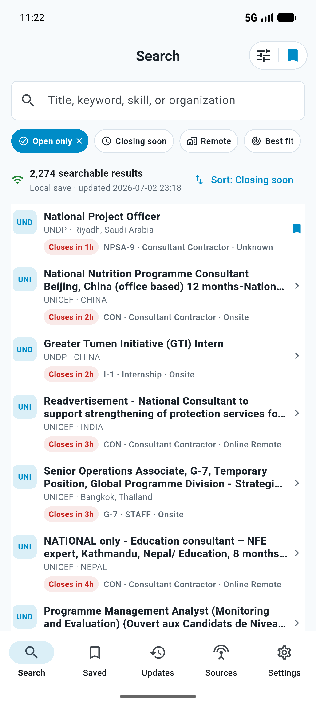
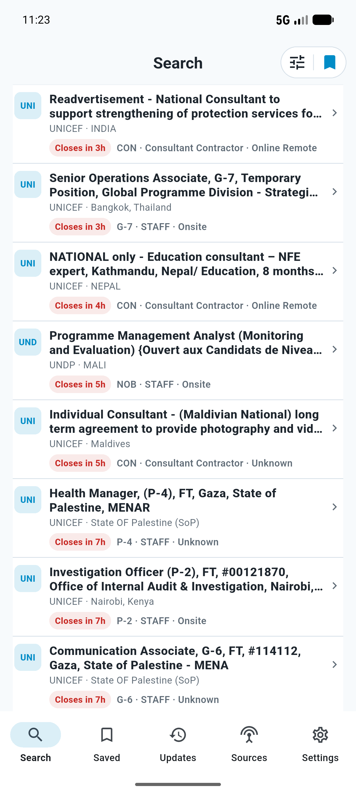
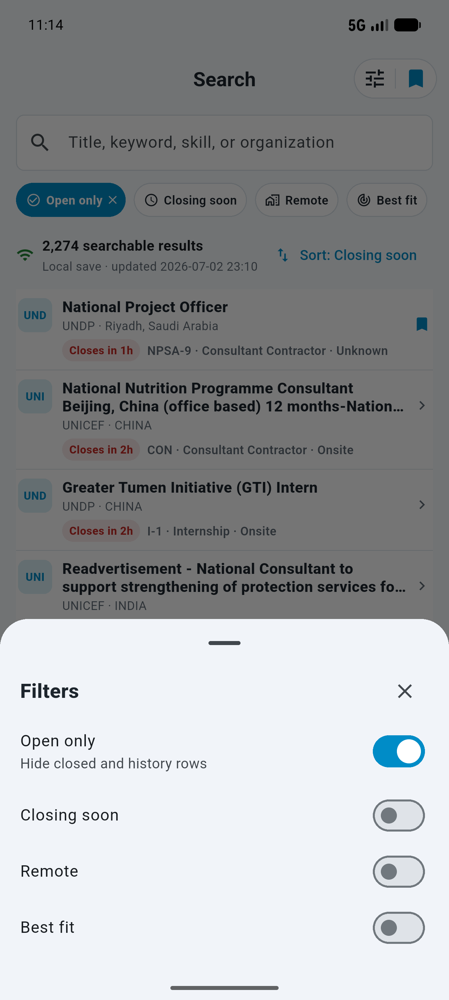
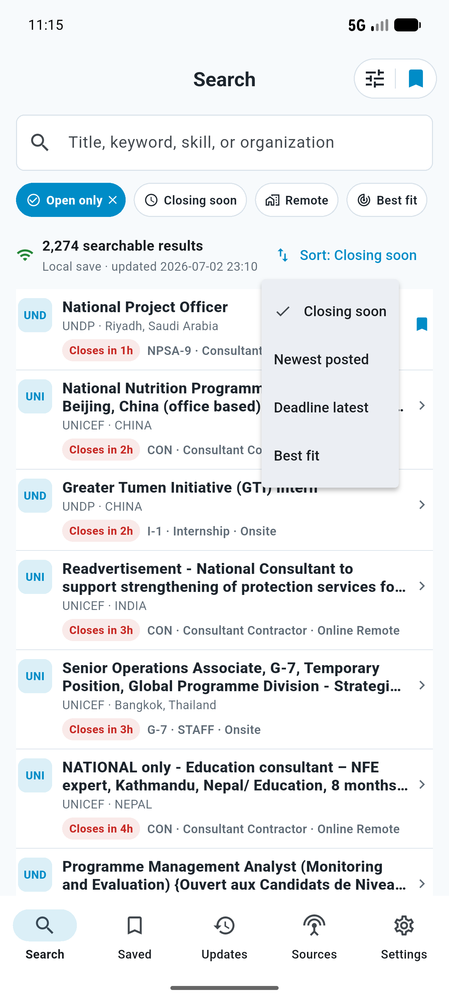
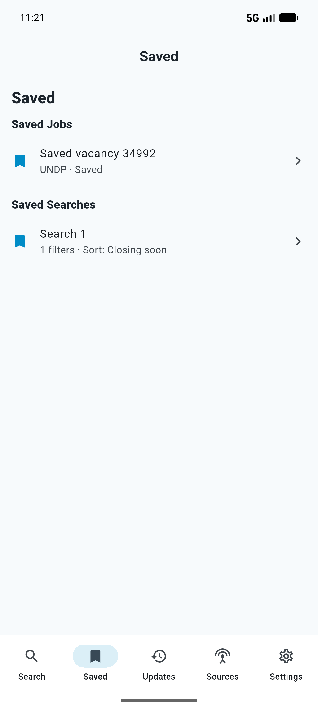
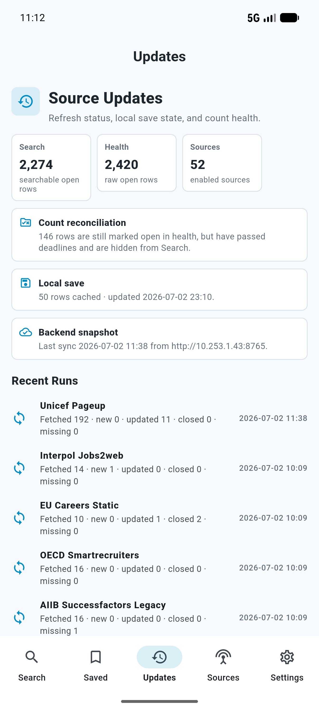
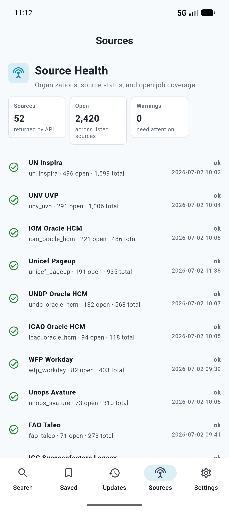
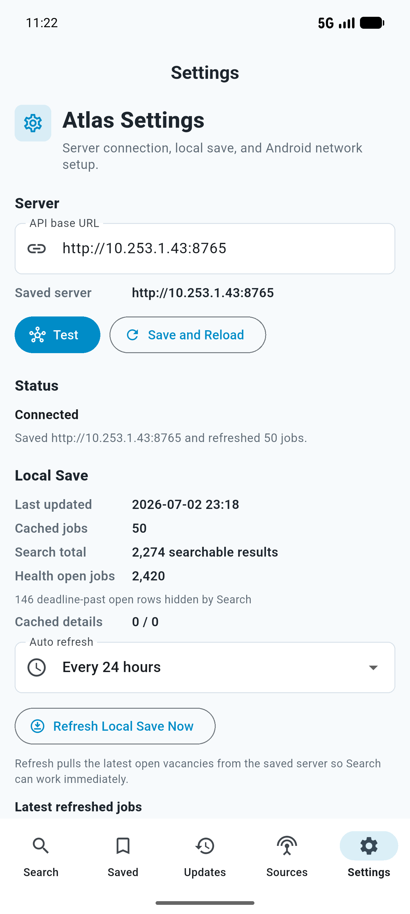

# Android Search UI Audit

Date: 2026-07-02
Branch: `codex/atlas-flutter-android-parity`
Slice: final Android parity closure

## Executive Result

The Flutter Android app now has a materially stronger Search parity slice plus implemented
Updates, Sources, Saved, Settings, and Job Detail flows. The final Android screenshots were
captured from the installed release APK on `emulator-5554` against the LAN backend
`http://10.253.1.43:8765`.

This is not a final 90%+ completion claim. No checked-in iOS screenshot/golden baseline was
found in the repo, so the visual score remains capped until a human compares these Android
screenshots against the live iOS app or provides iOS reference captures.

## iOS Reference Availability

No generated iOS screenshot bundle was found under `apps/apple/PreviewHost` or the Flutter
docs loop folders. The review package therefore uses these iOS source files as the reference
contract and embeds fresh Android screenshots for human comparison:

- `apps/apple/Sources/AtlasUI/SearchScreen.swift`
- `apps/apple/Sources/AtlasUI/SearchViewModel.swift`
- `apps/apple/Sources/AtlasUI/JobResultRow.swift`
- `apps/apple/Sources/AtlasUI/JobDetailView.swift`
- `apps/apple/Sources/AtlasUI/AtlasSearchFilters.swift`

## Side-By-Side Review Package

| Screen | iOS reference | Previous Android evidence | Final Android evidence | Review checklist |
| --- | --- | --- | --- | --- |
| Search top | Source reference: `SearchScreen.swift`, `JobResultRow.swift` | Previous parity slice: `screenshots/iteration-5/search_top.png` |  | Centered `Search` title, grouped filter/save controls, search input, compact chips, `2,274 searchable results`, compact local-save text, right-aligned sort link, dense rows. |
| Search scrolled | Source reference: `JobResultRow.swift` | Previous parity slice: `screenshots/iteration-5/search_scrolled.png` |  | Rows remain compact after scrolling; no diagnostic paragraphs in the main list; title maxes visually to compact row density. |
| Filter sheet | Source reference: `AtlasSearchFilters.swift` | Previous parity slice: `screenshots/iteration-5/filter_sheet.png` |  | Filter button opens real toggles for Open only, Closing soon, Remote, Best fit over live Search state. |
| Sort UI | Source reference: `SearchScreen.swift` | Previous parity slice: `screenshots/iteration-5/sort_menu.png` |  | Sort link opens real menu; active `Closing soon` state is visible. |
| Job detail | Source reference: `JobDetailView.swift` | Previous basic detail: `screenshots/iteration-5/job_detail.png` |  | Detail is populated with title, organization, location, deadline, grade, contract, modality/scope, saved state, and full description. Diagnostics stay hidden by default. |
| Saved tab | Source reference: app shell/search saved behavior | Previous parity slice: `screenshots/iteration-5/saved_tab.png` |  | Saved Jobs and Saved Searches render real data; saved rows are tappable. |
| Updates tab | Source reference: product tab requirement | Placeholder before this slice |  | Shows search count, health count, enabled sources, count reconciliation, local save, backend snapshot, and recent source runs. |
| Sources tab | Source reference: product tab requirement | Placeholder before this slice |  | Lists real API sources, open counts, total counts, status, warnings, and last observed times. |
| Settings tab | Source reference: product setup requirement | Earlier Settings: `screenshots/iteration-5/settings_tab.png` |  | Shows server URL, connection status, local save time, cached count, Search total, health open jobs, and deadline-past reconciliation. |

## Data Count Reconciliation

| Field | Value |
| --- | --- |
| `health_open_jobs` | `2,420` |
| `search_api_total` | `2,274` |
| `android_displayed_total` | `2,274 searchable results` |
| `active_filters` | Default Android Search: `status=["open"]`, no text query, no source/org filters, sort `closing_date_asc`; Search API default `exclude_expired_open=true`. |
| `local_cache_timestamp` | `2026-07-02 23:18` local app display |
| `backend_snapshot_timestamp` | `2026-07-02T02:38:47.964722+00:00` from `/api/health` (`2026-07-02 11:38` local display) |
| `excluded_count` | `146` |
| `excluded_reason_breakdown` | Open rows with `closes_at` earlier than current UTC time. They are still `status='open'` for health but are hidden by Search API `exclude_expired_open=true`. In SQLite they classify as `deadline_state='today'`, not history rows. |
| `final_decision` | `2,274` is correct for Android default Search because it matches `/api/search`. `2,420` is correct for `/api/health` because health counts raw open rows. The app now names the displayed count as searchable results and exposes the 146-row reconciliation in Settings and Updates. |

Deadline-past open source breakdown:

| Source | Hidden rows |
| --- | ---: |
| `un_inspira` | 45 |
| `unv_uvp` | 33 |
| `undp_oracle_hcm` | 18 |
| `iom_oracle_hcm` | 15 |
| `paho_workday` | 9 |
| `unwomen_oracle_hcm` | 5 |
| `wfp_workday` | 4 |
| `worldbank_csod` | 3 |
| `adb_taleo` | 2 |
| Other one-row sources | 12 |

## Implemented This Slice

- Android Search count label now distinguishes default searchable open rows from raw health open rows.
- Settings and Updates expose the Search vs Health reconciliation and explain the 146 hidden deadline-past open rows.
- Updates tab is no longer a placeholder; it shows live refresh status, local save state, backend snapshot, source counts, and recent source runs.
- Sources tab is no longer a placeholder; it lists real source health/open counts and can drive source-filtered Search state.
- Job Detail now loads `/api/job-detail`, shows core fields, full description, source/apply data when present, saved state, weak-detail handling, copy-link action, and expandable diagnostics hidden by default.
- Saved tab shows saved tracker records and saved searches with tappable rows.

## Verification

Commands run from `apps/atlas_flutter`:

- `dart format --set-exit-if-changed .` passed.
- `dart analyze` passed with no issues.
- `flutter test --coverage` passed: 34 tests, `1834/1856` lines, `98.81%`.
- `flutter build apk --debug` passed.
- `flutter build appbundle --release` passed.
- `flutter build apk --release` passed.
- `flutter test integration_test -d emulator-5554` passed.
- Release APK installed with `adb -s emulator-5554 install -r build/app/outputs/flutter-apk/app-release.apk`.

Build artifacts:

- Debug APK: `apps/atlas_flutter/build/app/outputs/flutter-apk/app-debug.apk`
- Release AAB: `apps/atlas_flutter/build/app/outputs/bundle/release/app-release.aab`
- Release APK: `apps/atlas_flutter/build/app/outputs/flutter-apk/app-release.apk`

## Visual Parity Assessment

Strengths:

- The Android Search top area now follows the iOS product structure: centered title, compact grouped filter/save controls, search box, chip row, compact count/status, right sort link, and dense job rows.
- Job rows no longer look like large verbose cards; diagnostic paragraphs are removed from the list.
- Normal local-save state is compact text, not a large banner.
- Bottom tabs are all navigable, and Updates/Sources are useful data screens rather than generic placeholders.

Remaining visual differences needing human review:

- No checked-in iOS screenshots or golden baselines were available for true side-by-side pixel comparison.
- Job Detail is useful but still text-heavy because full descriptions can dominate the first viewport.
- Saved job rows currently use synthesized labels like `Saved vacancy 34992` until richer tracker metadata is available.
- Local save is session-memory in the Flutter app; after app relaunch it must be refreshed again.

## Scorecard

Strict score with user caps applied: **80/100**.

Uncapped implementation evidence would score higher, but the user rule caps the result at 80 because no actual iOS side-by-side screenshot/golden evidence exists yet.

| Category | Score | Notes |
| --- | ---: | --- |
| Visual parity evidence | 17 / 25 | Full Android screenshot package exists; iOS screenshot baseline missing. |
| Functional completeness | 18 / 20 | Search/filter/sort/save/detail/tabs work; local save is not persisted across relaunch. |
| Data correctness | 20 / 20 | `2,274` vs `2,420` reconciled and surfaced in UI. |
| Updates/Sources completion | 10 / 10 | Both tabs implemented with live API data. |
| Job Detail completion | 8 / 10 | Core fields and full description render; grouping can still improve for long descriptions. |
| Tests/builds | 10 / 10 | Format, analyze, unit/widget coverage, integration, debug/release builds pass. |
| Human-review readiness | 4 / 5 | Audit and screenshots complete; still needs iOS visual and physical Pixel signoff. |

## Remaining Gates

- Human must compare the Android screenshot package with the iOS app/reference screenshots.
- Physical Pixel 8 Pro Android 17 verification is still required.
- A future slice should persist the local save/offline cache across app restarts.
- A future slice should enrich saved job rows with title/org metadata without waiting for detail open.
