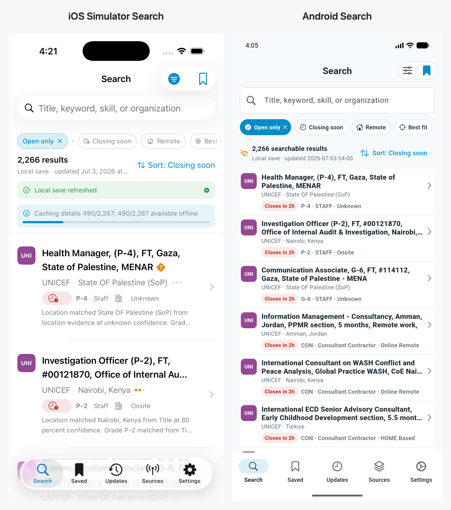
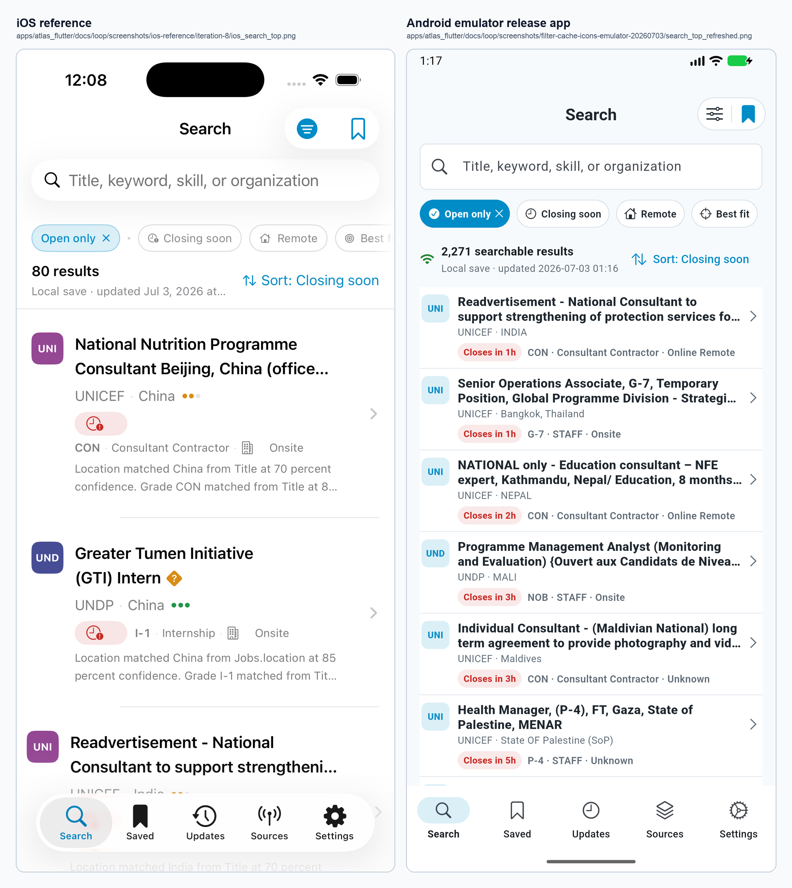
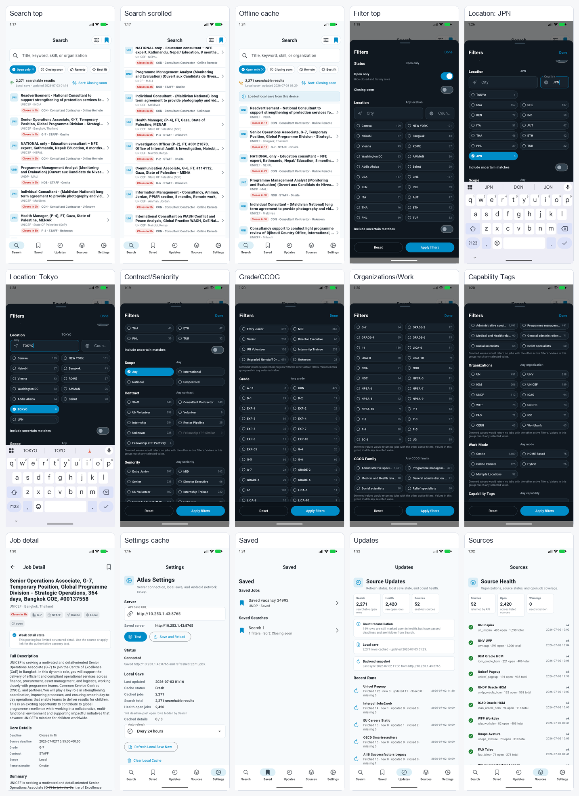

# iOS vs Android Visual Review Package

Date: 2026-07-03
Branch: `codex/atlas-flutter-android-parity`
Android evidence set: `screenshots/filter-cache-icons-emulator-20260703/`
Prior no-banner Android evidence set:
`screenshots/filter-cache-icons-emulator-20260703-current/`
Latest detail formatter evidence set:
`screenshots/detail-formatter-20260703/`
Fresh iOS Simulator reference set:
`screenshots/ios-simulator-reference-20260703/`
Android golden baseline:

- `../../test/goldens/android/search_top_compact.png`
- `../../test/goldens/android/filter_sheet_top.png`
- `../../test/goldens/android/job_detail_top.png`
- `../../test/goldens/android/saved_tab.png`
- `../../test/goldens/android/updates_tab.png`
- `../../test/goldens/android/sources_tab.png`
- `../../test/goldens/android/settings_tab.png`

## Evidence Boundaries

The repo now contains checked-in iOS Search-top screenshots plus a fresh iOS Simulator capture from
the built `AtlasIOSHost` app:

- `screenshots/ios-reference/iteration-7/ios_search_seeded_top.png`
- `screenshots/ios-reference/iteration-8/ios_search_top.png`
- `screenshots/ios-simulator-reference-20260703/ios_search_top_simulator.png`
- `screenshots/ios-simulator-reference-20260703/ios_simulator_android_search_side_by_side.png`

No local iOS reference screenshots exist for the filter sheet, cascade states, Job Detail, Saved,
Updates, Sources, or Settings. The user-provided iOS filter screenshots are therefore not available
as files in this worktree. Those screens are reviewed below against the written iOS requirements and
the Swift source structure, not against a pixel-paired iOS image.

Swift source references used for non-screenshot review:

- `apps/apple/Sources/AtlasUI/SearchScreen.swift`: iOS tab structure and Search navigation shell.
- `apps/apple/Sources/AtlasUI/AtlasSearchFilters.swift`: iOS filter model, active chip behavior,
  status/location/scope/grade/organization/capability filter fields, and chip removal semantics.
- `apps/apple/Sources/AtlasUI/JobDetailView.swift`: iOS detail screen hierarchy, classification
  rows, deadline panel, source link, and raw-record disclosure.

## Search Top Side-by-Side

Fresh iOS Simulator vs Android side-by-side image:

Earlier checked-in iOS reference side-by-side image:

| Review item | Status | Evidence |
| --- | --- | --- |
| Centered `Search` title | Pass | Fresh iOS Simulator and Android screenshots both show centered `Search`. |
| Top-right filter/bookmark group | Pass with style note | Android uses a rounded pill with Cupertino-style sliders/bookmark. Fresh iOS has the same grouped control hierarchy with a filled filter glyph. |
| Search box under header | Pass | Both place search field directly below the header controls. |
| Compact filter chips | Pass | Android chips are compact and horizontally arranged. |
| Result count and local-save text | Pass with label note | iOS says `2,266 results`; Android says `2,266 searchable results` to document the reconciled difference from health `open_jobs`. |
| Sort link alignment | Pass | Android sort control is compact and right aligned. |
| Normal-state banners | Intentional Android divergence | Fresh iOS Simulator still shows `Local save refreshed` and detail-cache banners. Android hides the normal cache-load banner per the newer Android requirement. |
| Compact list rows | Pass against current product requirement | Android rows are substantially denser and hide diagnostic text. Fresh iOS Simulator still shows diagnostic explanation text in rows, which conflicts with the newer Android acceptance rule. |
| Bottom navigation | Pass | Both show Search, Saved, Updates, Sources, Settings. |

## Android Screen Evidence

Single-image Android review contact sheet:

| Screen / state | iOS local reference | Android evidence | Review result |
| --- | --- | --- | --- |
| Search top | `screenshots/ios-reference/iteration-8/ios_search_top.png` | `screenshots/filter-cache-icons-emulator-20260703/search_top_refreshed.png` | Human-reviewable side-by-side generated. |
| Search top, fresh iOS Simulator | `screenshots/ios-simulator-reference-20260703/ios_search_top_simulator.png` | `screenshots/detail-formatter-20260703/search_after_relaunch.png` | Fresh side-by-side generated at `screenshots/ios-simulator-reference-20260703/ios_simulator_android_search_side_by_side.png`; Android matches the top hierarchy and intentionally hides normal-state banners/diagnostics. |
| Search top golden | iOS references above | `../../test/goldens/android/search_top_compact.png` | Android Search-top layout is covered by a Flutter golden. It is useful for regression, not a substitute for human screenshots because Flutter tests use the test renderer/font behavior. |
| Filter sheet top golden | Written iOS filter requirements; local iOS filter screenshot still missing | `../../test/goldens/android/filter_sheet_top.png` | Android filter-sheet top is covered by a Flutter golden for dark modal structure, compact option grids/counts, and sticky Reset/Apply footer. It supplements emulator screenshots and human review. |
| Job Detail top golden | Swift `JobDetailView.swift`; local iOS detail screenshot still missing | `../../test/goldens/android/job_detail_top.png` | Android populated Job Detail top is covered by a Flutter golden for useful detail content, metadata chips, formatted ATS body, and hidden raw diagnostics. It supplements the emulator `job_detail_top_fixed.png` screenshot. |
| Saved/Updates/Sources/Settings tab goldens | Swift `SearchScreen.swift`; local iOS tab screenshots still missing | `../../test/goldens/android/saved_tab.png`, `../../test/goldens/android/updates_tab.png`, `../../test/goldens/android/sources_tab.png`, `../../test/goldens/android/settings_tab.png` | Implemented tabs are covered by Flutter goldens with seeded saved jobs/searches, update runs, source health, cache status, and server controls. |
| Search top, no-banner regression | `screenshots/ios-reference/iteration-8/ios_search_top.png` | `screenshots/filter-cache-icons-emulator-20260703-current/search_refreshed_no_banner.png` | Prior release evidence shows `2,269 searchable results`, compact local-save text, and no large normal-state cache banner. |
| Search top, source badge parity | `apps/apple/Sources/AtlasUI/AtlasComponents.swift` `SourceMonogram` | `screenshots/source-badge-parity-20260703/search_badges_64bit.png` | Android source badges now use 34px rounded squares, Swift-style Unicode-scalar source colors, and white initials like Swift. |
| Search top, latest live count | `screenshots/ios-reference/iteration-8/ios_search_top.png` | `screenshots/detail-formatter-20260703/search_after_relaunch.png` | Current release shows `2,266 searchable results`, compact local-save text, and no large normal-state cache banner. |
| Search scrolled | Missing locally | `screenshots/filter-cache-icons-emulator-20260703/search_scrolled.png` | Android evidence captured; no local iOS pair. |
| Filter sheet top | Missing locally | `screenshots/filter-cache-icons-emulator-20260703/filter_top.png` | Matches written iOS requirements: dark sheet, drag handle, title, Done, sticky Reset/Apply, count pills. |
| Filter Contract/Seniority | Missing locally | `screenshots/filter-cache-icons-emulator-20260703/filter_contract_seniority.png` | Android evidence captured. |
| Filter Grade/CCOG | Missing locally | `screenshots/filter-cache-icons-emulator-20260703/filter_grade_ccog.png` | Android evidence captured. |
| Filter Organizations/Work Mode | Missing locally | `screenshots/filter-cache-icons-emulator-20260703/filter_organizations_workmode.png` | Android evidence captured. |
| Filter Capability Tags | Missing locally | `screenshots/filter-cache-icons-emulator-20260703/filter_capability_tags.png` | Android evidence captured. |
| Country -> City cascade | Missing locally | `screenshots/filter-cache-icons-emulator-20260703/filter_japan_selected.png` | `JPN` selected; city options narrow to `TOKYO`. |
| City -> Country cascade | Missing locally | `screenshots/filter-cache-icons-emulator-20260703/filter_tokyo_selected.png` | `TOKYO` selected; `JPN` remains visible as matching country option. |
| Multi City/Country values | Swift source has string fields; product requirement asks Android multi-select | `screenshots/filter-cache-icons-emulator-20260703/filter_japan_selected.png`, `screenshots/filter-cache-icons-emulator-20260703/filter_tokyo_selected.png`; tests in `test/atlas_filters_test.dart` and `test/atlas_search_controller_test.dart` | Android now accepts comma/semicolon-separated location text and multi-select pills; values serialize as Search API lists and filter cached rows as OR within Location. |
| Seniority -> Grade cascade | Missing locally | `screenshots/filter-cache-icons-emulator-20260703/filter_entry_junior_selected.png` | `Entry Junior` selected; Grade options narrow. |
| Grade selected | Missing locally | `screenshots/filter-cache-icons-emulator-20260703/filter_grade_selected.png` | Grade selected state captured. |
| Offline restart | Not applicable | `screenshots/filter-cache-icons-emulator-20260703-current/offline_restart_no_banner.png` | Cached rows visible immediately after offline relaunch with no large normal-state cache banner. |
| Settings cache status | Missing locally | `screenshots/detail-formatter-20260703/settings_after_reload.png` | Shows cache timestamp, freshness, cached/search/health counts, refresh and clear controls with current `2,266` count. |
| Job Detail | Missing locally | `screenshots/detail-formatter-20260703/job_detail_top_fixed.png` | Shows populated detail with ATS formatter output; raw source data is hidden from the main detail body and remains behind diagnostics. |
| Saved tab | Missing locally | `screenshots/filter-cache-icons-emulator-20260703/saved_tab.png` | Implemented screen captured. |
| Updates tab | Missing locally | `screenshots/filter-cache-icons-emulator-20260703/updates_tab.png` | Implemented screen captured. |
| Sources tab | Missing locally | `screenshots/filter-cache-icons-emulator-20260703/sources_tab.png` | Implemented screen captured. |

## Visual Checklist

- [x] Android title says `Search`.
- [x] Top-right filter/bookmark controls are visually grouped.
- [x] Search box is directly below the title/control area.
- [x] Applied filters are compact chips.
- [x] Results count and local-save status are compact.
- [x] Normal cache-load state does not show a large blue Search banner.
- [x] Sort control is compact and right aligned.
- [x] Job rows are compact and hide diagnostic paragraphs.
- [x] Source badges use per-source color blocks with white initials, matching Swift `SourceMonogram`.
- [x] Job Detail renders formatted ATS sections and keeps raw/debug source data out of the main body.
- [x] Bottom tabs are Search, Saved, Updates, Sources, Settings.
- [x] Filter sheet uses dark modal styling with `Filters`, `Done`, and sticky `Reset` / `Apply filters`.
- [x] Filter sheet exposes all required groups from the written iOS reference.
- [x] City/Country and Seniority/Grade cascade states have Android screenshot evidence.
- [x] Multi City/Country values are implemented in Android request serialization and offline cached filtering.
- [x] One-page Android evidence contact sheet is generated for human review.
- [x] Fresh iOS Simulator Search-top side-by-side is generated from a local `AtlasIOSHost` build.
- [x] Android Search-top, filter-sheet top, Job Detail top, and implemented tab layout goldens are checked in.
- [ ] Physical Pixel screenshots are captured after unlock.
- [ ] User-provided iOS filter/detail screenshots are checked into or copied into the repo for true pixel-paired comparison.

## Remaining Visual Differences / Risks

- The fresh iOS Simulator Search screenshot still includes diagnostic explanation text in list rows
  and normal-state local-save/detail-cache banners, while the newer Android requirement says
  diagnostics and normal cache-load banners must be hidden from the main Search list.
- Android filter icon style is Cupertino-style sliders, but not a pixel-identical clone of the
  filled iOS glyph in the checked-in reference.
- Android Location filters now support multiple City/Country values, but the visible text-field
  representation is comma-separated. Human review should decide whether this is visually close
  enough to iOS or should become a dedicated selected-chip editor.
- Physical Pixel rendering may differ from the emulator capture; the physical device must be
  unlocked and reviewed before this can be treated as final.

## Score Impact

This package satisfies the "create a reviewable evidence package" requirement for available local
artifacts, including a fresh local iOS Simulator Search-top side-by-side. It does not satisfy the
final human gate because iOS filter/detail reference images are still missing locally and physical
Pixel screenshots are still blocked. The strict completion score remains below 80 until those two
gaps are closed.
