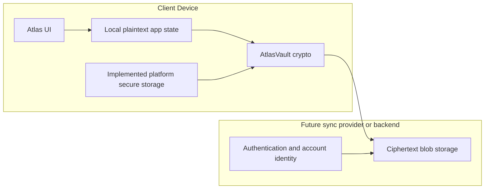

# Encrypted Multi-Device Sync Architecture

Status: local encrypted persistence, migration, recovery export/import,
platform secure storage, device identity, and explicit trusted-device pairing
and vault-key delivery are implemented. Account-backed ciphertext sync,
multi-device convergence, rollback protection, revocation, and key rotation
remain unimplemented. This document does not claim production multi-device
readiness.

## Current State

The Apple app has real SwiftUI code under `apps/apple/Sources/AtlasUI/`.
`AtlasLocalCache` now serializes `AtlasPublicLocalSnapshot`, while private saved
searches and saved jobs are hydrated from encrypted AtlasVault records. The
corresponding private-free cache checks are in
`apps/apple/Tests/AtlasUITests/AtlasPublicLocalSnapshotTests.swift` and
`apps/apple/Tests/AtlasUITests/AtlasVaultPayloadTests.swift`.

Apple Keychain, Android Keystore, and Windows current-user DPAPI adapters hold
device-local key material. Python, Dart, and Swift implementations cover signed
device descriptors, pairing offers and acceptances, replay-aware trusted-device
state, authenticated key delivery, acknowledgement, and explicit local pairing
presentation. See
[Phase 2F-1](phase2f1_device_identity_and_pairing_foundation.md) and
[Phase 2F-2](phase2f2_trusted_device_pairing_and_key_delivery.md).

The local FastAPI service in `services/job-api` exposes plaintext local
endpoints for saved searches and tracker records:

- `GET /api/saved-searches`
- `POST /api/saved-searches`
- `GET /api/tracker`
- `POST /api/tracker`
- `POST /api/tracker/jobs/{job_key}`
- `DELETE /api/tracker/{record_id}`

The validated launcher defaults to direct-loopback admission at
`127.0.0.1:8765`; it also supports explicit token or disabled modes and has no
unauthenticated open mode. These controls protect a local compatibility API,
not a cloud synchronization service.

These local plaintext paths are not cloud sync architecture. They must not be
used as internet-facing sync endpoints.

## Target Architecture

Atlas multi-device sync should use a zero-knowledge vault model:

The client owns encryption and decryption. The provider or backend owns only
authentication, routing, storage, cursors, and conflict metadata.

## Component Boundaries

### Local Plaintext API

The existing local API may continue to serve the local app during the transition.
It returns plaintext saved searches and tracker records and is appropriate only
for local loopback use.

It is not acceptable as a cloud sync API because it exposes user-saved text to
the service boundary and lacks authentication.

### Future Ciphertext-Only Sync API

The future sync API may accept only encrypted vault metadata, encrypted record
blobs, record IDs, revisions, parent revisions, tombstone markers, key IDs,
logical clocks, timestamps, and opaque device IDs.

It must never accept plaintext saved searches, saved jobs, application notes,
generated documents, personal histories, raw vault keys, passphrases, recovery
keys, or decrypted payloads.

### Authentication And Account Identity

Authentication identifies the account or device allowed to store and retrieve
opaque blobs. It is separate from encryption.

Authentication tokens, account IDs, and device IDs must never be treated as vault
keys. Account services must never receive passphrases, recovery keys, or raw
vault keys.

### Encryption Keys

AtlasVault v1 generates a random 256-bit vault key. The vault key encrypts
record payloads. A passphrase or recovery key wraps the vault key. The passphrase
or recovery key itself is never stored, and raw vault keys are never serialized
into vault files.

Trusted local devices store protected vault-key material through their platform
secure-storage boundary. Explicit pairing can deliver the vault key to another
locally admitted device without serializing a raw key into the transported
artifact.

### Local Secure Storage

Platform secure storage is implemented for the current local clients:

- Apple uses device-only, non-synchronizable Keychain items;
- Android uses a non-exportable Android Keystore key to protect no-backup local
  state;
- Windows uses current-user DPAPI for its protected local state.

The concrete boundaries are documented in
[Apple Keychain integration](phase2d8_keychain_secitem_adapter.md),
[Android secure storage](phase2e2_android_secure_key_and_encrypted_store.md),
and [Windows secure storage](phase2e5_windows_secure_key_and_encrypted_store.md).
This implemented local custody does not establish server-side device
management, remote revocation, key rotation, or protection after a device is
unlocked.

### Cloud Blob Storage

Cloud storage is future work. CloudKit, object storage, a custom FastAPI
backend, or another provider may store encrypted blobs only. The provider must
not store plaintext user text or raw secrets.

### Manual Encrypted Export And Import

Manual encrypted export/import is implemented as a non-cloud interoperability
path. Export bundles contain encrypted vault metadata and encrypted record
blobs; passphrase or recovery-key handling and decryption remain local. The
current import path is deliberately bounded and is not a substitute for an
account-backed synchronization protocol.

## Data Separation

The `jobagg` public job database remains separate from private user vault data.
Public job records, taxonomies, and search indexes are not vault records.

The `private/` directory remains the boundary for generated documents, local
histories, databases, logs, caches, keys, and personal data. Sync foundation
work must not move private user data into tracked source files.

## Record Model

AtlasVault v1 uses record-level encrypted objects:

- each record has an opaque `id`;
- each update creates a `revision`;
- `parent_revision` links updates for conflict detection;
- `deleted` marks tombstones;
- `key_id` selects a wrapped-key context without revealing plaintext;
- `nonce` and `ciphertext` carry AES-GCM encryption output.

The server can compare revisions and tombstones without decrypting records.
Clients resolve semantic conflicts locally after decrypting.

## Cryptographic Decisions

The v1 suite is:

- AES-256-GCM for authenticated record encryption and key wrapping;
- HKDF-SHA256 for record subkeys;
- Argon2id for passphrase-based wrapping-key derivation;
- random salts of at least 128 bits;
- random 96-bit AES-GCM nonces that are never reused with the same key;
- stable JSON schema versions for metadata and records.

XChaCha20-Poly1305 is only a possible future suite if libsodium is adopted
consistently across all clients.

## Lifecycle

### Create A Vault

1. Client generates a 256-bit vault key.
2. Client derives a wrapping key from a passphrase or recovery key with Argon2id.
3. Client wraps the vault key using AES-256-GCM.
4. Client serializes vault metadata containing wrapped-key metadata only.

### Add Or Update A Record

1. Client creates a plaintext `saved_text` payload locally.
2. Client derives a record subkey from the vault key, vault ID, and record ID.
3. Client encrypts the payload with AES-256-GCM.
4. Client authenticates vault and record metadata through AES-GCM associated
   data.
5. Client stores or syncs only the encrypted record object.

### Sync Records

1. Client uploads encrypted metadata and encrypted records.
2. Provider stores opaque blobs and conflict metadata.
3. Client downloads changed encrypted records.
4. Client decrypts locally and merges locally.

### Onboard A Device

The current device-to-device onboarding flow is explicit and local. It uses
signed device descriptors, signed offer and acceptance artifacts, a
replay-resistant pairing transcript, bilateral confirmation, authenticated
vault-key delivery, acknowledgement, and a trusted-device registry. It does not
include QR onboarding, a network broker, continuous record exchange, device
revocation, or key rotation.

### Remove A Device

Future removal should support key rotation:

1. remove or disable the device key wrap;
2. generate a new vault key or new key epoch;
3. re-encrypt records or future writes according to the rotation policy;
4. preserve enough revision metadata for conflict resolution.

Phase 1 does not implement key rotation.

## Implementation Phases

Phase 0 created contracts and architecture documents. Phase 1 created the
Python reference package and crypto tests for:

- metadata serialization;
- vault key generation;
- passphrase wrapping and unwrapping;
- record encryption and decryption;
- tamper detection;
- version rejection;
- deterministic test-only vectors.

Subsequent merged phases implemented local migration, platform secure storage,
manual recovery export/import, cross-platform encrypted interoperability,
device identity, and explicit trusted-device pairing and key delivery. Future
phases still need the ciphertext-only account/device-registry backend,
encrypted patch/snapshot convergence, malicious-server rollback defenses,
revocation, and key rotation.

## Security Warnings

Do not use:

- `SHA256(password)` as an encryption key;
- AES-CBC without authentication;
- unauthenticated encryption;
- reused AES-GCM nonces with the same key;
- hardcoded keys;
- plaintext cloud sync;
- sync providers that store plaintext user text;
- backends that store raw vault keys, passphrases, or recovery keys;
- logs containing plaintext, keys, passphrases, or decrypted vault contents;
- current plaintext `/api/saved-searches` or `/api/tracker` endpoints as
  internet-facing sync endpoints.
