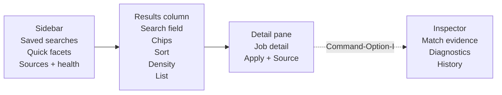

# Atlas Design System

Status: draft design-system contract  
Applies to: shared SwiftUI iPhone and Mac app in `apps/apple`  
Companion spec: `packages/jobagg/docs/ios_macos_search_app_spec.md`

## 1. Design Intent

Atlas is a calm, evidence-forward design language for the `jobagg` search app. It should feel native on iPhone and Mac, dense enough for serious vacancy research, and clear enough for fast daily triage.

The core product promise is not only "find jobs", but "show why this job is relevant". Every visual decision should support that: search results are compact, filters are visible without dominating the screen, and match evidence is a first-class interaction.

Design principles:

- Native first: prefer SwiftUI and platform conventions over custom web-style controls.
- Evidence forward: make match reasons, confidence, and source health visible without clutter.
- Dense but readable: support high information throughput, especially on Mac.
- Restrained color: use color as signal, not decoration.
- Server-aware: show freshness, coverage, and degraded source states plainly.

## 2. Color

Use system backgrounds and one primary accent. Avoid large custom color fields, gradient panels, or decorative color blocks.

### Core Palette

| Token | Value | Usage |
|---|---:|---|
| `accent` | UN Cyan family, around `#009FD8` to `#00AEEF`, desaturated about 15% | Selection, active chips, links, focused search rings, primary apply button |
| `strategyOrange` | Warm orange, for example `#F28C28` | Strategy-fit score only |
| `deadlineNeutral` | system secondary gray | Deadlines outside urgency windows |
| `deadlineAmber` | system amber/orange | Deadlines within 7 days |
| `deadlineRed` | system red | Deadlines within 48 hours |
| `success` | system green | Healthy source, high-confidence checks |
| `warning` | system yellow/orange | Source warning, sparse coverage, medium confidence |
| `danger` | system red | Source issue, deadline critical, destructive confirmation |

### Rules

- `strategyOrange` is reserved exclusively for strategy-fit score badges, score rings, and "Best fit" sort state.
- Do not use orange for generic primary buttons.
- Deadline urgency appears as a tinted capsule, never by turning the whole row red.
- Light mode uses pure system surfaces: `.background`, `.secondarySystemGroupedBackground`, list row backgrounds, sidebar materials.
- Dark mode uses elevated grouped backgrounds and system materials; urgency colors must be desaturated enough to maintain contrast.
- Mac does not use a colored header band. The accent appears in selection, links, chips, focus rings, and score-specific UI.

## 3. Typography

Use SF Pro through system text styles. Do not define custom font families.

| Element | Style | Notes |
|---|---|---|
| Navigation title | `.largeTitle` on iPhone, toolbar title on Mac | Collapses naturally on iPhone |
| Result title | `.headline` | Two-line max on iPhone |
| Organization and duty station | `.subheadline` | Secondary color |
| Metadata row | `.caption` | Use monospaced digits for grades, dates, and scores |
| Detail section title | `.headline` or `.title3` | Depends on pane width |
| Evidence text | `.caption` or `.footnote` | Secondary color unless warning |

Typography rules:

- Support Dynamic Type throughout.
- Do not scale type manually with viewport width.
- Use monospaced digits only for scan-aligned metadata, not for body text.
- In compact Mac rows, favor alignment and truncation over shrinking text below accessible sizes.

## 4. Iconography

Use SF Symbols only. Do not use emoji as primary controls.

| Concept | Symbol |
|---|---|
| Search | `magnifyingglass` |
| Filters | `line.3.horizontal.decrease.circle` |
| Closing soon | `clock.badge.exclamationmark` |
| High confidence | `checkmark.seal` |
| Needs review | `questionmark.diamond` |
| Strategy fit | `target` |
| Source health | `antenna.radiowaves.left.and.right` |
| Save | `bookmark` / `bookmark.fill` |
| External source | `arrow.up.right.square` |
| Apply | `paperplane` or `arrow.up.forward.app` |
| Refresh | `arrow.clockwise` |
| Warning | `exclamationmark.triangle` |
| History | `clock.arrow.circlepath` |
| Inspector | `sidebar.trailing` |

Icon rules:

- Icons in buttons need accessibility labels.
- If a symbol is unfamiliar, pair it with text or provide a tooltip on Mac.
- Metadata icons should be quiet and secondary unless they represent urgency or source health.

## 5. Signature Components

### 5.1 FilterChip

Purpose: show active filters and quick filters in a compact, removable form.

Behavior:

- Capsule shape.
- Active state uses accent tint.
- Inactive quick chips use subtle system fill.
- Active chips include a trailing `xmark` affordance on hover or tap target.
- iPhone chip row remains one horizontal row; it never wraps into a second row.
- Mac chips can wrap in the filter editor but not in the results toolbar row.
- Active chips animate from the filter sheet or editor using `matchedGeometryEffect` where practical.

Content examples:

- `Open only`
- `Nairobi`
- `KEN`
- `P-2 to P-4`
- `International`
- `Home-based`
- `Best fit >= 70`

### 5.2 ConfidenceDot

Purpose: make match confidence glanceable without adding long evidence text to every row.

Visual:

- Three tiny segments or dots.
- High confidence: three filled segments.
- Medium confidence: two filled segments.
- Low confidence: one filled segment and warning color.
- Missing evidence: hollow or muted.

Interaction:

- Mac hover opens a popover with source field, confidence value, and evidence snippet.
- iPhone tap opens a compact evidence sheet or expands the evidence row.
- Detail screen shows the full evidence text; list rows show only the dot.

Mapped data:

- Location confidence and evidence from `match_evidence.location`.
- Grade confidence and source field from `match_evidence.grade`.
- Scope reason from `match_evidence.scope`.
- Future taxonomy confidence fields where available.

### 5.3 DeadlinePill

Purpose: render closing urgency consistently.

States:

- More than 7 days: neutral capsule, e.g. `Closes Jun 28`.
- 7 days or fewer: amber capsule, e.g. `Closes in 6d`.
- 48 hours or fewer: red capsule, e.g. `Closes in 31h`.
- Past: muted capsule, e.g. `Deadline passed`.
- Unknown: secondary capsule, e.g. `No deadline`.

Interaction:

- Mac hover shows absolute date, local time if available, and timezone.
- iPhone detail shows absolute date in the header and source/history section.

### 5.4 ScoreRing

Purpose: show strategy-fit score only when strategy scoring is active.

Rules:

- Render in `strategyOrange`.
- Display 0 to 100, derived from server score 0.0 to 1.0.
- Never render on unscored searches.
- Tapping or hovering reveals score reasons.
- "Best fit" sort uses the same orange accent so users learn the signal.

### 5.5 SourceMonogram

Purpose: provide lightweight source identity without scraping logos.

Visual:

- Rounded square, 2 to 3 letter initials.
- Deterministic hue derived from organization or source ID.
- Text uses high-contrast foreground.
- Keep corner radius at 8px or platform equivalent.

Rules:

- Do not fetch third-party logos in the client.
- Use organization display name when the API provides it; fall back to source ID initials.

### 5.6 WhyMatchedPanel

Purpose: make the app's differentiator visible and useful.

Placement:

- First content block in job detail.
- Available as a compact popover or inspector section from result rows.

Content:

- Query terms that matched.
- Location evidence and confidence.
- Grade evidence and confidence.
- Scope reason.
- Strategy score reasons, when active.
- Source coverage caveat if relevant.

Tone:

- Factual, not promotional.
- Prefer short lines: "Location matched Nairobi from raw duty station, confidence 0.98."

## 6. iPhone Experience

Use a focused triage model. The user should be able to run a saved search, scan results, inspect match evidence, and open an application source quickly.

### Navigation

Five tabs:

1. Search
2. Saved
3. Updates
4. Sources
5. Settings

### Search Screen

Structure:

- Large-title `Search`.
- `.searchable` field pinned under the title and collapsed on scroll.
- One horizontally scrolling chip row below search.
- Count and sort row.
- Divider-separated result rows.
- Filter toolbar button with active-filter count badge.

Result row layout:

1. Title, two lines max, with optional `ScoreRing` trailing.
2. `SourceMonogram`, organization, duty station, and `ConfidenceDot`.
3. `DeadlinePill`, grade capsule, contract tag, and modality icon.

Rows should be edge-to-edge list rows, not floating cards. Use separators and vertical rhythm for hierarchy.

Actions:

- Tap row: open job detail.
- Swipe leading: save or unsave.
- Swipe trailing: open source, apply.
- Pull to refresh: rerun active query against the server.
- Updated timestamp appears under the result count, e.g. `Updated 2m ago`.

### Filter Sheet

Presentation:

- `.sheet` with medium and large detents.
- Grouped `Form`.
- Sticky bottom bar with `Show N results` and `Reset`.

Sections:

1. Location
2. Contract and Grade
3. Work Mode
4. Organization and Source
5. Function and Taxonomy
6. UNV
7. Dates and Status
8. Strategy Fit

Section behavior:

- Collapsed headers show active summaries, e.g. `Location - Nairobi, KEN`.
- Searchable full-screen pickers are used for countries, organizations, CCOG, and capability tags.
- Recents appear above full lists in large pickers.
- Empty facet groups are hidden by default.
- `Show all fields` reveals sparse or empty metadata fields with explanatory footnotes.

### Job Detail

Layout:

- Pinned header with title, organization, status, and `DeadlinePill`.
- Action row: `Apply` as filled accent button, `Source` as bordered button.
- First section: `WhyMatchedPanel`.
- Description section.
- Classification section.
- Source and history section.

When backend section extraction exists, show jump chips:

- Responsibilities
- Qualifications
- Competencies
- Benefits
- How to apply

### Saved Searches

Rows are natural-language summaries, not raw filter lists.

Example:

`Open international P-2 to P-4 roles in Nairobi, closing soon`

Row metadata:

- Last run time.
- New since last run count.
- Closing soon count.
- Warning badge when source health affects the search.

Actions:

- Tap: run search.
- Swipe: Run, Edit, Delete.
- Delete requires confirmation.

### Updates

Use segmented control:

- New
- Closing soon
- Changed
- Missing

The same result row component should render jobs across all update states. Source-health warnings appear as a dismissible amber banner.

## 7. Mac Experience

Use a research-tool model. The Mac app should support fast keyboard navigation, dense scanning, split-view detail review, and optional evidence inspection.

### Structure

Use `NavigationSplitView`:

- Sidebar: about 220pt.
- Results column: 360 to 460pt.
- Detail pane: flexible.
- Inspector: optional 280pt trailing panel.

### Sidebar

Sections:

- Library: Search, Updates.
- Saved Searches: pinned searches with live new-count badges.
- Sources: source list with health dots.
- Quick Facets: optional high-use filters.

Use standard Mac sidebar styling with vibrancy material. Source health colors:

- Green: OK.
- Amber: warning/degraded.
- Red: issue.
- Gray: unknown/not run.

### Results Column

Toolbar:

- Integrated search field.
- Filter button.
- Sort menu.
- Density toggle.
- Save search button.
- Refresh button.

Below toolbar:

- One active-chip row.
- Result count and updated timestamp.
- Result list.

Density modes:

- Comfortable: three-line rows similar to iPhone.
- Compact: two-line rows with aligned metadata columns and monospaced digits.

Keyboard:

- `Command-F`: focus search.
- `Command-Option-F`: open full filter editor.
- `Command-R`: refresh active query.
- `Command-S`: save active search.
- `Command-Return`: open selected job source or detail action, depending focus.
- Arrow keys: move selection.
- `j` and `k`: optional list navigation.
- Space: Quick Look-style description peek.
- `Command-Option-I`: toggle inspector.

### Detail Pane

Wide layout:

- Header and action toolbar at top.
- Main description in the primary column.
- Match evidence and classification in a right-side column when width allows.
- At narrower widths, stack sections vertically.

Actions:

- Apply.
- Source.
- Save.
- Copy link.
- Add to tracker in later phase.

### Inspector

The inspector is for power-user evidence and diagnostics. It keeps the detail pane clean.

Sections:

- Match evidence.
- Strategy score reasons.
- Classification raw fields.
- Source-run diagnostics.
- Change-event log.
- Facet coverage stats.
- Sparse taxonomy warnings.

## 8. Filters and Facets

### Filter Hierarchy

High-frequency filters should be easy to reach:

- Text
- Status
- Location
- Deadline
- Grade
- Contract
- Work modality
- Organization
- Strategy score

Advanced filters stay behind disclosure:

- CCOG exact codes.
- Occupational family/medium.
- Mandate network/family.
- Capability tags.
- UNV fields.
- ATS family.
- Confidence thresholds.

### Facet Behavior

- Facets update after committed filter changes.
- Count changes should fade-update rather than jump.
- Sparse groups show: `No data in this database yet`.
- Unknown values are hidden in default pickers unless the user enables `Show unknown values`.
- Facet rows should include count, label, and selected state.

### Confidence Controls

Default:

- Enforce server defaults: location confidence >= 0.70 and grade confidence >= 0.70.

Exploratory mode:

- User can enable `Include uncertain matches`.
- Low-confidence results remain visible but carry `ConfidenceDot` warnings.
- Result count row should state that uncertain matches are included.

## 9. State Design

### Empty Search

Do not show a blank pane.

Use:

- Pinned saved searches.
- Recent queries.
- Suggested quick filters.
- Server status summary.

### No Results

Show:

- Active filters summary.
- Suggested filters to remove.
- `Include uncertain matches` option when location/grade filters are active.
- Saved-search option if the query is important.

### Loading

Use:

- Redacted skeleton rows.
- Stable row heights.
- Progress text only when loads exceed normal latency.
- Fade-in facet count updates.

### Offline or Server Down

Show:

- Server URL.
- Last successful connection time.
- `Open Settings`.
- Cached last results, grayed and timestamped, when available.

### Sparse Taxonomy

When a taxonomy facet has no coverage:

- Show an explanatory footnote in the picker.
- Do not show empty checklists.
- Use source health or classification coverage in the inspector for details.

### Source Health Issues

Show source warnings without blocking search unless the backend marks data unsafe.

Display:

- Amber banner for warnings/degraded runs.
- Red banner for issue state.
- Link to Sources tab or inspector diagnostics.

## 10. Accessibility

Requirements:

- Full Dynamic Type support.
- VoiceOver labels for chips, deadline pills, score rings, and confidence dots.
- Sufficient color contrast in light and dark mode.
- Do not communicate urgency or confidence by color alone.
- All destructive actions require confirmation.
- All hover-only Mac affordances must have click or keyboard equivalents.
- Result rows must have stable hit targets.

VoiceOver examples:

- `ConfidenceDot`: "Location confidence high. Double tap for evidence."
- `ScoreRing`: "Strategy fit score 82 out of 100. Double tap for reasons."
- `DeadlinePill`: "Closes in 3 days, June 14, 2026."

## 11. Motion

Use motion sparingly.

Allowed:

- Chip insertion/removal using matched geometry.
- Facet count fade updates.
- Inspector open/close platform animation.
- Pull-to-refresh platform behavior.

Avoid:

- Decorative background motion.
- Bouncy card animations.
- Reflow-heavy filter transitions.
- Loading animations that shift row height.

## 12. Implementation Notes

SwiftUI structure:

- Shared package for design tokens and components.
- Shared API DTOs generated or hand-aligned with `contracts/api`.
- Platform-specific shells for iPhone tabs and Mac split view.
- Components should accept server DTO values rather than reading SQLite directly.

Suggested component modules:

- `DesignTokens`
- `FilterChip`
- `ConfidenceDot`
- `DeadlinePill`
- `ScoreRing`
- `SourceMonogram`
- `JobResultRow`
- `WhyMatchedPanel`
- `FilterEditor`
- `SavedSearchRow`
- `SourceHealthBadge`

Data-source rule:

The app must use the HTTP API. It must not read SQLite bundles or scrape ATS sites directly.

## 13. Acceptance Criteria

The design system is implemented well when:

- The same result row model works on iPhone, Mac comfortable mode, and Mac compact mode.
- Active filters are always visible as chips.
- Large vocabularies are searchable, not long checkbox walls.
- A user can understand why a job matched without opening raw JSON.
- Strategy scoring is visually distinct but not decorative.
- Sparse taxonomy coverage is visible and honest.
- Server health and freshness are visible.
- The UI remains native-looking on both platforms.

## 14. Open Decisions

1. Keep UN Cyan as the accent or shift to a more neutral teal/indigo.
2. Use divider rows on iPhone as the default, with boxed cards only if testing shows stronger scan performance.
3. Decide whether saved searches move from JSON to SQLite before alert scheduling ships.
4. Decide how much source-run diagnostic detail belongs in the default detail pane versus the inspector.
5. Decide whether iPhone can trigger sync or only view server-side sync status.
